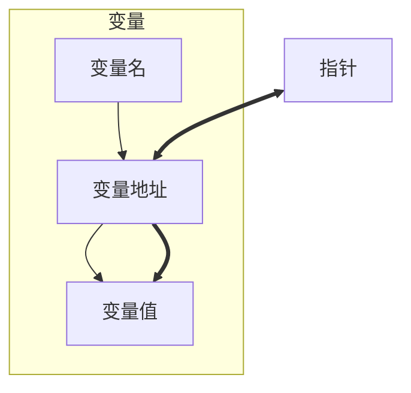
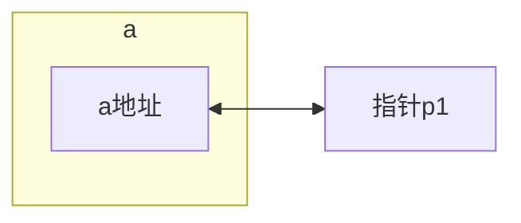
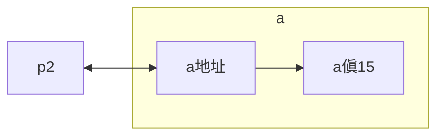
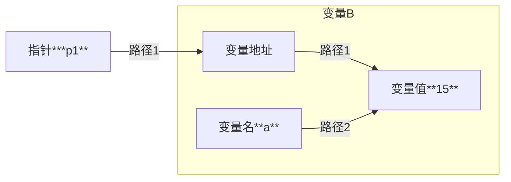

### 基础概念


#### 1.概念： 变量存放在内存中的*地址*


#### 2.定义方法：

```
    类型名 *变量名1, *变量名2, ...;
```   

由于**数组**本质是一串连续地址，因此
```
    类型名 数组名[数组长度];
```
中**数组名**就是该数组的指针


### 使用

#### 1.取地址运算符`&`

``
p1=&a
``


#### 2.间接访问运算符`*`
```
    int *p2,a;
    *p2=a;
```

此时
```
    *p1=15  //路径1
    a=15    //路径2
```
完全等价，但原理不同，如下：


#### 3.空指针`NULL`

### 指针与一维数组

假设有如下定义：
```
    int *p1， *p2;
    int data[10]={0,1,2,3,4,5,6,7,8,9};
```
此时`data`指向`data[0]`，可以进行运算`p1=data`或者`p1=&data[0]`，两者等价。

**有关运算**
```
    p1=data;
    p2=p1+1; \\此时相当于p2=data[1]
```
由此可见，对数组指针进行整数加(减)相当于对数组下标向增加(减小)的方向移动整数个。 并且可以简写为
```
    p2=p1[1];
```

## 题目整理

1. 设fun函数的定义如下，则其返回值是
int fun(int *p)
{

      return (*p)++;
}
A.  不确定的值
B.  *p自增前的整数值
C.  形参p中存放的值
D.  形参p的地址值
<details>
 <summary>答案</summary>
 <br>B</br>
 <br>解析：
 <br>p++是后增</br>
 </br>
</details>