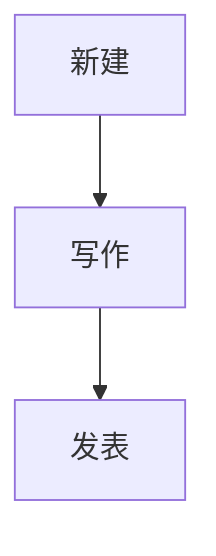
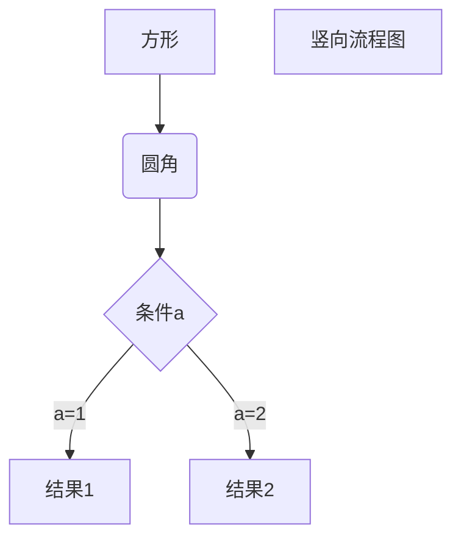
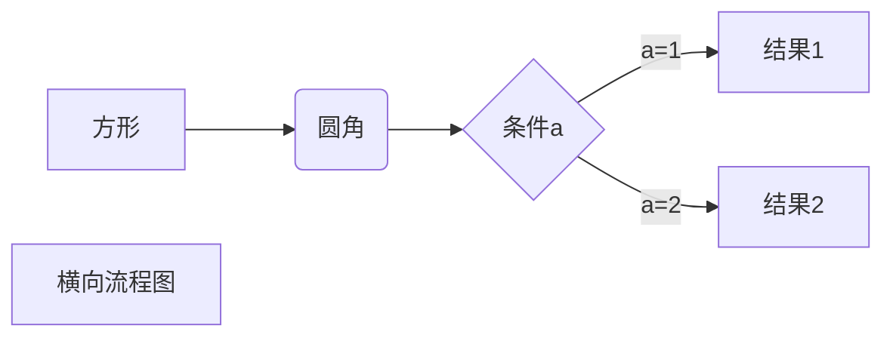

<!-- more -->
## 关于Hexo上的文本功能
在我们已经搭建好的Hexo上，可以进行一些简单的操作：写一篇文章并发表。

## 流程概览


## 新建
用`git bash`打开库文件夹，输入命令
```
hexo new [layout] <title>
```
[Layout]是类型名，默认有三种，分别对应着不同的模板。分别是`page`、`post`和`draft`。具体区别是他们的`Front-matter`不同, 保存目录不同, `page`生成的文件名为`index.md`。
- Page  
  **静态内容**：用于创建独立、不受时间影响的内容（如网站首页、关于我、分类、标签）。  
  **组织结构**：可形成页面层级（例如：父页面“服务” → 子页面“网页设计”“SEO优化”）。
```
---
title: {{ title }}
date: {{ date }}
---
```

- Post  
  **动态内容**：适合按时间发布的更新（如博客文章、新闻、教程）。  
  **分类系统**：通过分类（Categories） 和标签（Tags） 进行内容组织。  
  **社交互动**：支持评论、分享，适合内容营销。
```
---
title: {{ title }}
date: {{ date }}
tags:
---
```

- Draft  
  Hexo的独特机制，基本和`Post`一样.
```
---
title: {{ title }}
tags:
---
```
\<title>是标题，可以使用任意语言。

## 写作
常用的语法是markdown。可以看相关的[教程](https://www.runoob.com/markdown/md-tutorial.html "菜鸟：Markdown 教程")。我在这里简单介绍 一下使用频率较低但重要的指令。

### 插入图片
```


```
### 插入代码
- 行内代码：将代码用反单引号包围起来。
- 段间代码：将代码` ``` `包围起来。

### 插入流程图

这里根据使用的Markdown插件不同, 所以有时候需要添加其他的`mermaid`插件才能正常渲染.
如果渲染后仍然是代码块形式, 则需要安装额外的mermaid插件.

- 竖式流程图

- 横式流程图

## 发表
```
hexo generate
```
这一命令可以生成仓库`post`和`page`文章的静态文件. `draft`文件夹并不包括在内, 如果我们想让`draft`内的文章被看到, 则需要**发表**文章,将文章从`draft`移到`post`文件夹下: 

在`git bash`中输入
```
hexo publish [layout] <title>
```