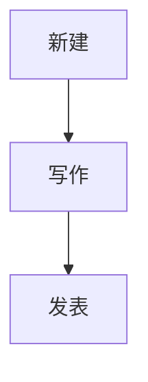
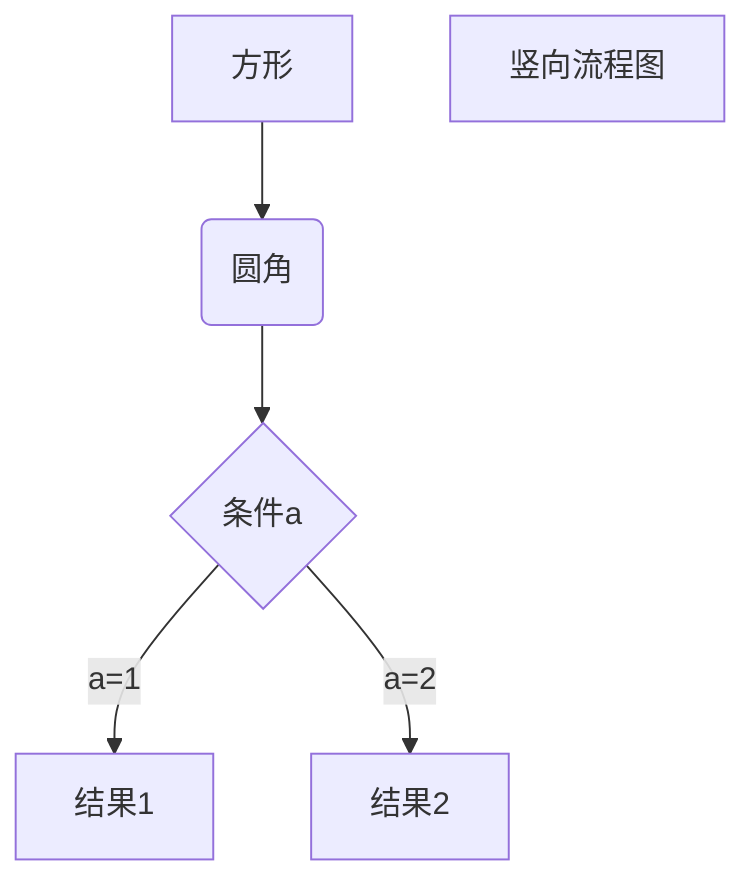
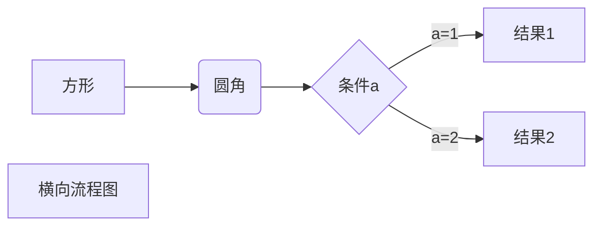

# 建站教程
## 关于Hexo上的文本功能
在我们已经搭建好的Hexo上，可以进行一些简单的操作：写一篇文章并发表。

## 流程概览


## 新建
用git bash打开库文件夹，输入命令
```
hexo new [layout] <title>
```
[Layout]是类型名，有三种，对应着不同的模板。分别是`page`、`post`和`draft`。具体区别是他们的`Front-matter`不同，同时会被保存在source目录下的不同文件夹中。
- Page
```
---
title: {{ title }}
date: {{ date }}
---
```

- Post
```
---
title: {{ title }}
date: {{ date }}
tags:
---
```

- Draft
```
---
title: {{ title }}
tags:
---
```
\<title>是标题，可以使用任意语言。

## 写作
常用的语法是markdown。可以看相关的[教程](https://www.runoob.com/markdown/md-tutorial.html "菜鸟：Markdown 教程")。我在这里记录一下使用频率较低但重要的指令。

### 插入图片
```


```
### 插入代码
- 行内代码：将代码用反单引号包围起来。
- 段间代码：将代码` ``` `包围起来。
### 插入流程图
- 竖式流程图

- 横式流程图

## 发表
本文章所说的发表是指将`draft`格式转化为`post`或者`page`格式。我们需要利用`git bash`
在`git bash`中输入
```
hexo publish [layout] <title>r
```
即可将draft文件夹中的文件移到post文件夹。