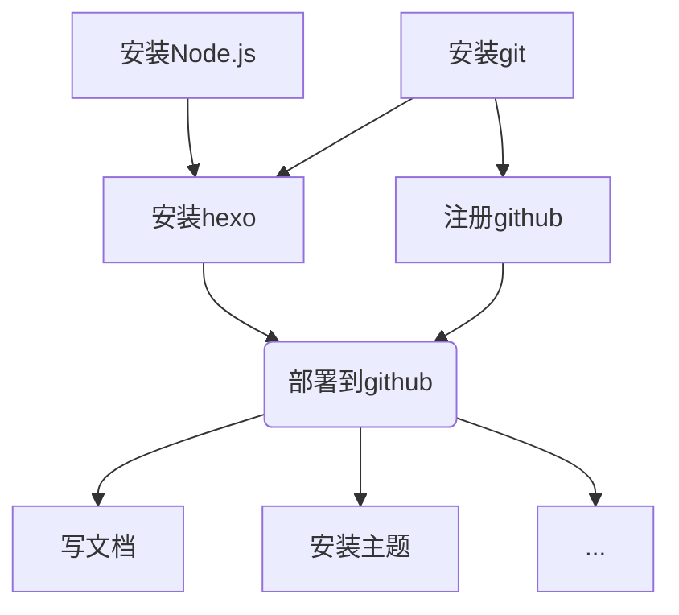

# 建站教程

## Hello World
从1016整到1023。要不是 DDL 提前还能拖着……

有一说一，我把这玩意儿整出来真挺不容易的，不管是被时间限制还是各种莫名的报错（点名No Laytout，这个我只能重来一遍解决，呵呵了）...虽然是社团的任务，但是自己也确实想搞一个记录生活。哇哈哈哈哈。
总而言之，这个网站也是有了一个雏形。
那就用建立博客教程来作为我第一个博客吧（！

---

## 流程概览

如果你的github账号里已经有了个人网站，可以通过发布一个`仓库`网站建站。



## 详细介绍

### 1. 准备工作（建议不要放在磁盘根目录）

#### 1.1 安装 `Node.js`
[官方下载链接](https://nodejs.org/en)

#### 1.2 安装 `git`
[官方下载链接](https://git-scm.com/download/win)

### 2. 为你的博客管理文件夹安装 Hexo
经过多次实验，建议不要放在磁盘根目录下（权限和路径问题会麻烦）。

- 在你准备好的空文件夹中，右键用 Git Bash 打开或在终端中进入该目录，先全局安装 hexo-cli：

```bash
npm install -g hexo-cli
```

+ 检查是否成功

```
hexo -v
```

- 初始化 Hexo（注意：目录应为空）：

```bash
# 在当前空目录初始化 Hexo
hexo init

# 或指定目录
hexo init my-blog
```

- 安装依赖：

```bash
npm install
```  
注意：有警告也是正常的，在执行完`npm install`时，可能出现
```bash
npm warn ... 
```
不过这不重要，成功的标志是
```bash
added 241 packages, and audited 242 packages in 25s

38 packages are looking for funding
  run `npm fund` for details

found 0 vulnerabilities
```
- 在本地运行  
```bash
hexo clean         #清理文件
hexo generate      #生成静态文件
hexo server        #启动服务器
```
现在，你已经完成本地部署。可买通过访问 <http://localhost:4000>（在某些编辑器/终端中 **Ctrl+点击链接** 可直接打开），看到网站雏形。以后我们可以利用这个检查网站的效果再发布。  


值得注意的是, `hexo server`后停止访问网站需要`Ctrl`+`C`停止。


如果想让别人通过网站访问你，则需要**上传到云端**。  
接下来我们要将本地上传到 GitHub，让大家访问你的站点。

### 2.部署到github
由于初次建站和再次建站有些区别，所以我将分开讲解，已经有过一个网站的友友可以直接看**项目网页**.  

#### 首次建站/个人网页  

* 创建仓库
  Github中`new`一个repository
  Repository name `[用户名.github.io]`
* 本地配置SSH Key
  在git bash页面分别输入以下命令
  
  ```coffeescript
  git config --global user.name <你的用户名>           # 配置个人信息-username
  git config --global user.email <你的GitHub邮箱>      # 配置个人信息-useremail
  ssh-keygen -t rsa -C <你的GitHub邮箱>	            # 生成密钥
  ```
  
  完成后右键打开`<id_rsa.pub>`文件并复制里面的全部内容
* 添加SSH Key到Github
  [https://github.com/settings/ssh/new](https://github.com/settings/ssh/new)
  New即可
* 同步SSH Key到本地git
  
  ```coffeescript
  eval "$(ssh-agent -s)"
  ssh-add ~/.ssh/id_rsa
  
  ssh-add ~/.ssh/id_rsa   
  
  #测试电脑与github通信
  #成功 显示Hi Yw37153! You've successfully authenticated, but GitHub does not provide shell access.
  ```
* 修改Hexo配置文件
  在_config.yml中#Deployment下替换：
```
> #Deployment
> ##Docs: [](https://hexo.io/docs/deployment.html)[https://hexo.io/docs/deployment.htm](https://hexo.io/docs/deployment.htm)
> deploy:
> type: git
> repo: [git@github.com](mailto:git@github.com):XXXXX/XXXXX.github.io.git
> branch: main
```
* 上传博客到Github
  
  ```coffeescript
  npm install hexo-deployer-git --save  #安装hexo-deployer-git插件
  
  hexo cl && hexo g && hexo d  #上传
  ```
显示

```
INFO Deploy done: git
```

即为成功。

#### 项目网页

- 新建仓库（本地和github）
- 打开仓库`Setting`，`General`，勾选`Template repository`。
- 检查SSH
  - 在`git bash`中输入
  ```
  git -T git@github.com
  ```
  正常应该显示
  ```
  Hi Yw37153! You've successfully authenticated, but GitHub does not provide shell access.
  ```
- git初始化文件夹
```
git init
```
- 


---

## 一些常用的命令
* 更新设置  

本地检查
```
hexo clean
hexo generate
hexo s
```  
上传
```
hexo clean
hexo g
hexo d
```


