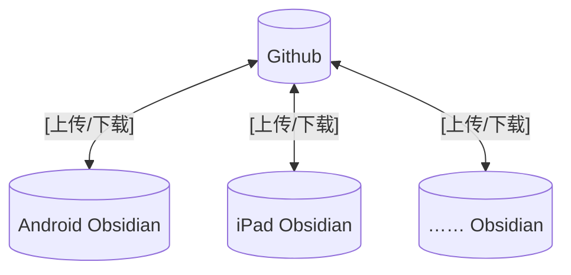

# 前言
Obsidian是一款本体完全本地的markdown编辑软件，因其本身的简洁风与高可玩性广受各类人群喜爱。，虽然Obsidian本体允许用户通过iCloud进行同步，但在其受众中采用**iPad+Windows**的电子设备混搭方案是一种相当普遍的方案。因此同步成为其不可避免的问题之一。

为解决同步问题，本文介绍一种完全免费且几乎可以涵盖所有可能性的方案，包括手机的同步。

# 原理讲解

本文方案围绕`github`进行，原理是将仓库储存在`github`上，各端通过Obsidian的`git`插件下载/上传`github`上的更新内容。
**图示**：



# 步骤

## 首次上传云端

由于我们的一切操作依赖于`github`，因此我们需要先将初始仓库上传至云端。这里以Win端上传为例。  

仓库名以`Ywww`为例，大家可以直接替换成自己的名字

- 在**网页**新建一个同步用的仓库

- 进入**网页**仓库，选择绿色Code按钮，复制**SSH地址**备用。

    
- 使用`Git Bash`**进入仓库**并**初始化git**

```bash
cd D:\Ywww
git init  // 初始化 git 项目
```

- **添加远程仓库**

在这步中，可以告诉git你的仓库在哪里，你需要把哪个仓库上传哪个云端仓库。

```bash
git remote add origin git@github.com:Yw37153/Ywww.git // 添加远程仓库
```
- 在根目录下**创建**`.gitignore`文件。
  把不需要备份的文件写一下，这样可以减少大部分同步的时间。
```
.obsidian
.vscode
```
~~以下是来自Gemini的建议~~
```
# 忽略操作系统生成的临时文件
.DS_Store
Thumbs.db
```
- 缓存+提交+推送，将**本地仓库上传至云端**

```bash
git add .
git commit -m "git bash"
git push -u origin main
```

至此，仓库已经上传云端，Win端也与云端仓库建立联系。 

## iOS同步仓库更新

在APP Store下载**iSH**，这是一个可以在IPad上使用Linux命令行的软件，接下来一系列操作我们需要在命令行里进行。

- 在IPad**下载Git**

```bash
apk update          //更新软件包
apk add git         //下载git
```

- 在Obsidian里创建新的仓库，用于同步，仓库名与云端保持相同

- 挂载目录

在iSH中输入：

```bash
mount -t ios obsidian /mnt
```

选择**Obsidian文件夹**后进入：

```bash
cd /mnt/Ywww  //进入文件夹
```


注意：这里的mnt是固定的，不要修改成`/mnt/Obsidian/<Repo>`或者`/Obisdian/<Repo>`等。


- 配置git

```bash
git config --global user.name "<Github用户名>"
git config --global user.email "<Github邮箱>"
git config --global --add safe.directory /mnt/Ywww  // 添加安全目录
```

- 配置远程仓库

```bash
git init   // 初始化 git
git branch -M main  // 调整分支为 main
git remote add origin <仓库的Https地址>  // 添加远程仓库
git pull origin main  // 拉取远程代码
```

- 等待一会后，会让你输入用户名和密码

```bash
Username for '<https://>': <用户名>
Password for '<https://>': <你的验证Token>
```

运行结束后会有提示。完毕后在Obsidian中检查一下仓库是不是已经拉取成功，拉取成功后进行对**Obsidian**插件的配置。

- [Token获取指南](#Token获取)

- 进入**Obsidian**
- 下载**Git**插件
- 进入插件设置进行配置——详见 [插件配置指南](#插件配置指南)

## 配置Android端

下载`Termux`，和iOS相同，这也是一个可以在手机上运行的Linux命令行。

- 准备环境

```bash
termux-setup-storage  //申请权限
pkg update            //获取更新
pkg install git       //下载git
```

- 用Obsidian创建同名新仓库

- 进入文件夹

```bash
cd ~/storage/emulated/0/documents/Obsidian/Ywww  //进入仓库
```

- 配置git

```bash
git config --global user.name "<Github用户名>"
git config --global user.email "<Github邮箱>"
git config --global --add safe.directory <你的本地仓库地址>  // 添加安全目录
```

- 配置远程仓库

```bash
git init   // 初始化 git
git branch -M main  // 调整分支为 main
git remote add origin <仓库的Https地址>  // 添加远程仓库
git pull origin main  // 拉取远程代码
```

同样，接下来会让你输入用户名和密码：

```bash
Username for '<https://>': <用户名>
Password for '<https://>': <你的验证Token>
```

- 在Obsidian里检查是否拉取成功，然后配置插件——详见 [插件配置指南](#插件配置指南)

# 常见问题

为了以后再次遇到类似问题时能快速搞定，这里为你**精炼整理**出一套针对安卓手机（Obsidian + Termux + Git）的黄金修复与同步指南。

## Dubious Ownership

当 Termux 提示 `detected dubious ownership` 时，复制并运行以下命令，信任你的笔记目录：

```bash
git config --global --add safe.directory /storage/emulated/0/Documents/Obsidian/Ywww
```

## bad tree object HEAD

如果出现 `bad tree object HEAD` 或**文件损坏**报错，直接在笔记目录下执行

```bash
rm -rf .git && git init               # 删掉旧仓库，原地重建
git add . && git commit -m "re-init"   # 重新打包本地所有笔记
git remote add origin https://github.com/Yw37153/Ywww.git  # 重新绑定云端
git branch -M main                    # 强行指定主分支为 main
```

## Obsidian 插件防错检查表

回到 Obsidian 软件内，确保以下 3 项配置正确，即可一劳永逸：

1. **分支名称（Branch）：** 必须只填 `main`，绝对不能带 `origin/` 前缀。
2. **凭证管理（Authentication）：** 密码位置必须填写 GitHub 的 **Token（个人访问令牌）**，直接填网页登录密码会导致同步失败。
3. **遇到残留报错弹窗：** 修复完成后，**彻底杀死 Obsidian 后台并重启**，报错即可消除。

<a id="插件配置指南"></a>
## 插件配置指南

成功拉取代码后，你需要配置插件以实现自动同步。以下是关键配置项：

### Automatic（自动同步）

| 配置项 | 说明 |
|--------|------|
| `Split timers for automatic commit and sync` | ✅ 勾选 |
| `Auto commit interval (minutes)` | 自动提交间隔 |
| `Auto pull interval (minutes)` | 自动拉取间隔 |
| `Auto push interval (minutes)` | 自动推送间隔 |
| `Pull on startup` | ✅ 勾选（避免版本不一致） |

### Authentication/commit author（凭证配置）

| 配置项 | 填写内容 |
|--------|----------|
| `Username on your git server` | GitHub 用户名 |
| `Password/Personal access token` | GitHub Token（[获取方式](#Token获取)） |

<a id="Token获取"></a>
## Token获取

由于 Git 插件配置和命令行拉取都需要使用 Token（而非直接使用密码），你需要在 GitHub 上生成一个 Personal Access Token。

- 登录 GitHub，点击右上角头像 → **Settings** → **Developer settings** → **Personal access tokens** → **Fine-grained tokens**
- 点击 **Generate new token (classic)**
- 给 Token 起一个名字（如 `Obsidian Sync`, 可以随意取）

### Token权限选择

- `Expiration`（有效期）: `No expiration`
- `Repository access`: `Only select repositories`（在里面选择你的权限仓库）
- `Repository permissions`:
  - **Read** access to actions, issues, metadata, and pull requests
  - **Read** and **Write** access to code


- 点击 **Generate token**，复制生成的 Token 并妥善保存

> 注意：Token 只在生成时显示一次，如果遗失需要重新生成。

